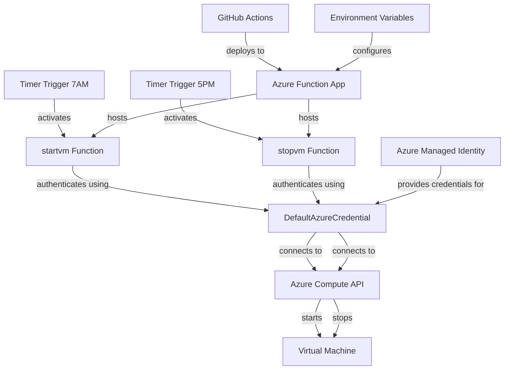

# Architecture Diagram

## Component Description

### Timer Triggers
The application uses two CRON-based timer triggers:
- **Morning trigger (6:00 UTC)**: Activates the startvm function on weekdays
- **Evening trigger (16:00 UTC)**: Activates the stopvm function on weekdays

### Authentication Flow
1. The DefaultAzureCredential provides token-based authentication
2. The function app uses managed identity to access Azure resources
3. No credentials are stored in the code or configuration files

### API Interactions
1. ComputeManagementClient interacts with Azure Resource Manager
2. VM operations are performed asynchronously with begin_start and begin_power_off
3. Operation results are logged for monitoring

### Deployment Pipeline
1. Code is pushed to the master branch
2. GitHub Actions workflow is triggered
3. Dependencies are installed and cached
4. Function app is deployed using Azure Functions Core Tools