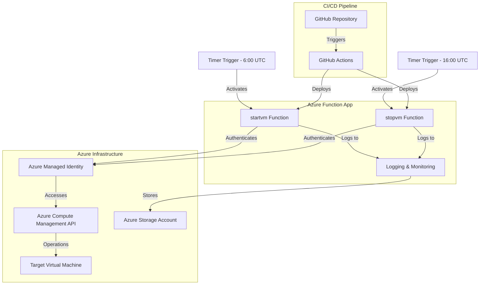
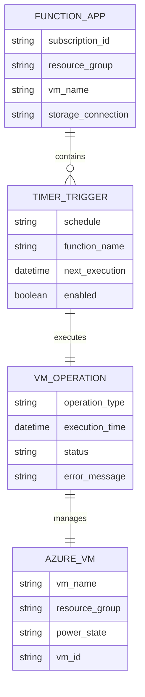
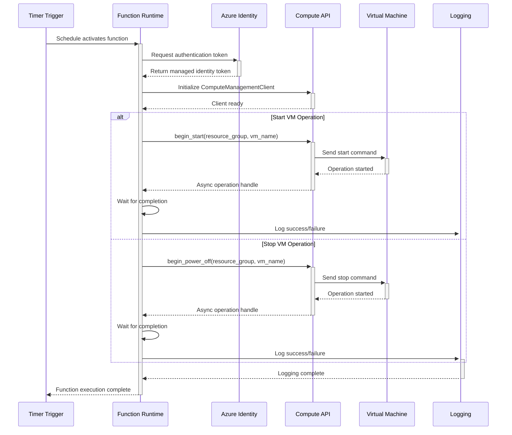

# 🏗️ System Architecture

## 📖 Overview
This document outlines the architecture of the Start/Stop VM Azure Function App, an automated serverless solution designed to optimize cloud costs by managing Azure Virtual Machine lifecycles based on predefined schedules. The system leverages Azure Functions with timer triggers to automate VM operations during business hours.

---

## 🏛️ High-Level Architecture



The architecture follows a serverless pattern with scheduled automation, emphasizing security through managed identity authentication and cost optimization through automated VM lifecycle management.

---

## 🧩 Core Components

### Timer Trigger Functions
- **Purpose**: Scheduled execution of VM management operations based on business hours
- **Technology**: Azure Functions Timer Triggers with CRON expressions
- **Location**: `function_app.py` (lines 50-63)
- **Responsibilities**:
  - Execute VM start operations at 6:00 UTC (7:00 AM UTC+1) on weekdays
  - Execute VM stop operations at 16:00 UTC (5:00 PM UTC+1) on weekdays
  - Provide logging and execution context
- **Interfaces**: Azure Functions runtime, Timer trigger binding

### VM Management Layer
- **Purpose**: Core business logic for starting and stopping Azure Virtual Machines
- **Technology**: Azure Compute Management SDK, Python async operations
- **Location**: `function_app.py` (lines 30-44)
- **Responsibilities**:
  - Initialize Azure Compute Management Client
  - Execute asynchronous VM start operations
  - Execute asynchronous VM stop operations
  - Handle operation completion and error management
- **Interfaces**: Azure Compute Management API, Azure Resource Manager

### Authentication & Identity
- **Purpose**: Secure, credential-free authentication to Azure resources
- **Technology**: Azure DefaultAzureCredential, Managed Identity
- **Location**: `function_app.py` (lines 25-26)
- **Responsibilities**:
  - Provide token-based authentication to Azure APIs
  - Manage credential rotation automatically
  - Ensure secure access without stored secrets
- **Interfaces**: Azure Identity services, Azure Active Directory

### Configuration Management
- **Purpose**: Environment-specific configuration and runtime settings
- **Technology**: Environment variables, Azure App Settings
- **Location**: `function_app.py` (lines 10-22)
- **Responsibilities**:
  - Store Azure subscription ID securely
  - Configure target resource group and VM name
  - Provide storage connection strings
- **Interfaces**: Azure Function App configuration, environment variables

---

## 📊 Data Models & Schema



### Key Data Entities
- **Function Configuration**: Environment variables and app settings that control VM targeting and authentication
- **Timer Schedule**: CRON-based schedule definitions for automated execution timing
- **VM State**: Current operational state and metadata of target virtual machines
- **Operation Logs**: Execution history, success/failure states, and error information

### Relationships
- Function App → Timer Triggers: One function app hosts multiple timer-triggered functions
- Timer Triggers → VM Operations: Each trigger executes specific VM management operations
- VM Operations → Azure VMs: Operations target specific VMs identified by resource group and name

---

## 🔄 Data Flow & Interactions



### Request/Response Flow
1. **Timer Activation**: Azure Functions runtime triggers the scheduled function based on CRON expression
2. **Authentication**: Function obtains managed identity token through DefaultAzureCredential
3. **Client Initialization**: ComputeManagementClient is initialized with authenticated credentials
4. **VM Operation**: Asynchronous start or stop operation is initiated on the target VM
5. **Operation Monitoring**: Function waits for operation completion and logs results
6. **Error Handling**: Any failures are caught, logged, and handled gracefully

---

## 🚀 Deployment & Environment

### Development Environment
- **Platform**: Python 3.10+, Azure Functions Core Tools v4
- **Dependencies**: azure-functions, azure-mgmt-compute, azure-identity, azure-storage-blob
- **Setup**: Local development with Azure Functions Core Tools and VS Code Azure Functions extension

### Production Considerations
- **Scalability**: Serverless auto-scaling based on timer triggers (fixed schedule, no scaling concerns)
- **Performance**: Sub-second function startup time, operations complete within 2-3 minutes
- **Monitoring**: Azure Application Insights integration with comprehensive logging

### Configuration Management
- **Environment Variables**: 
  - `AZURE_SUBSCRIPTION_ID`: Target Azure subscription
  - `AzureWebJobsStorage`: Function app storage account connection
- **Secrets**: Managed through Azure Key Vault integration (if additional secrets needed)
- **Resource Targeting**: Configured via `RESOURCE_GROUP` and `VM_NAME` constants

---

## 🔒 Security Architecture

### Authentication & Authorization
- **Authentication**: Azure Managed Identity provides automatic token-based authentication
- **Authorization**: Function app identity requires Contributor or Virtual Machine Contributor role on target resources
- **Session Management**: Token refresh handled automatically by Azure Identity SDK

### Data Protection
- **Encryption**: All communication encrypted via HTTPS/TLS
- **Input Validation**: Environment variable validation and subscription ID format checking
- **Data Privacy**: No sensitive data stored in code or logs (subscription ID partially masked)

### Security Measures
- **Managed Identity**: Eliminates need for stored credentials or connection strings
- **Least Privilege**: Function identity scoped to specific resource group and VM operations only
- **Secure Configuration**: Environment variables stored in Azure App Settings with encryption at rest

---

## ⚡ Error Handling & Resilience

### Error Management Strategy
- **Error Detection**: Try-catch blocks around all Azure API operations
- **Error Reporting**: Comprehensive logging with Azure Functions built-in logging framework
- **Error Recovery**: Graceful failure handling with detailed error messages

### Resilience Patterns
- **Retry Logic**: Azure SDK provides built-in retry mechanisms for transient failures
- **Timeout Handling**: Async operations include timeout configurations
- **Circuit Breaking**: Function execution limits prevent runaway operations

---

## 🎯 Design Decisions & Trade-offs

### Key Architectural Decisions
1. **Timer Triggers vs Event-Driven**
   - **Decision**: Use timer triggers with CRON schedules
   - **Rationale**: Predictable business hours automation with no external dependencies
   - **Alternatives**: Event-driven triggers, manual execution, Logic Apps
   - **Trade-offs**: Gained simplicity and reliability, lost flexibility for dynamic scheduling

2. **Managed Identity vs Service Principal**
   - **Decision**: Use Azure Managed Identity for authentication
   - **Rationale**: Enhanced security, no credential management, automatic token rotation
   - **Alternatives**: Service principal with secrets, certificate-based authentication
   - **Trade-offs**: Gained security and simplicity, limited to Azure-hosted execution

3. **Single VM vs Multi-VM Management**
   - **Decision**: Target single VM per function app instance
   - **Rationale**: Simplicity, clear responsibility, easier troubleshooting
   - **Alternatives**: Dynamic VM discovery, configuration-based multi-VM support
   - **Trade-offs**: Gained simplicity and reliability, requires multiple deployments for multiple VMs

### Known Limitations
- **Single VM Targeting**: Currently hardcoded to manage one VM per deployment
- **Fixed Schedule**: Business hours schedule is not dynamically configurable
- **Error Notification**: No external alerting for operation failures

### Future Considerations
- **Multi-VM Support**: Configuration-driven VM list management
- **Dynamic Scheduling**: Database or configuration-driven schedule management
- **Alerting Integration**: Teams/Slack notifications for operation failures
- **Cost Reporting**: Integration with Azure Cost Management APIs

---

## 📁 Directory Structure & Organization

```
startstopvm/
├── function_app.py       # Main function application with VM management logic
├── requirements.txt      # Python dependencies for Azure Functions
├── host.json            # Azure Functions runtime configuration
├── .funcignore          # Files to ignore during deployment
├── .gitignore           # Git ignore patterns
├── README.md            # Project documentation and usage guide
├── ARCHITECTURE.md      # System architecture documentation (this file)
├── SKILLS-INDEX.md      # Skills and competencies catalog
├── AUTHORS.md           # Contributors and author information
├── LICENSE.txt          # MIT license terms
├── .repo-context.json   # Repository metadata and context
├── .github/             # CI/CD pipeline configuration
│   └── workflows/       # GitHub Actions workflow definitions
└── .vscode/             # VS Code configuration and settings
```

### Organization Principles
- **Single Responsibility**: Each file has a clear, focused purpose
- **Configuration Separation**: Runtime config, dependencies, and documentation clearly separated
- **Standard Structure**: Follows Azure Functions Python project conventions

---

## 🔗 External Dependencies

| Dependency | Purpose | Version | Documentation |
|------------|---------|---------|---------------|
| azure-functions | Azure Functions Python runtime and bindings | Latest | [Azure Functions Python](https://docs.microsoft.com/en-us/azure/azure-functions/functions-reference-python) |
| azure-mgmt-compute | Azure Compute Management SDK for VM operations | Latest | [Azure Compute SDK](https://docs.microsoft.com/en-us/python/api/azure-mgmt-compute/) |
| azure-identity | Azure authentication and credential management | Latest | [Azure Identity SDK](https://docs.microsoft.com/en-us/python/api/azure-identity/) |
| azure-storage-blob | Azure Storage integration for function runtime | Latest | [Azure Storage SDK](https://docs.microsoft.com/en-us/python/api/azure-storage-blob/) |

---

## 📚 References
- [Project README](README.md)
- [Skills Documentation](SKILLS-INDEX.md)
- [Azure Functions Documentation](https://docs.microsoft.com/en-us/azure/azure-functions/)
- [Azure Compute Management API](https://docs.microsoft.com/en-us/rest/api/compute/)
- [Azure Managed Identity](https://docs.microsoft.com/en-us/azure/active-directory/managed-identities-azure-resources/)